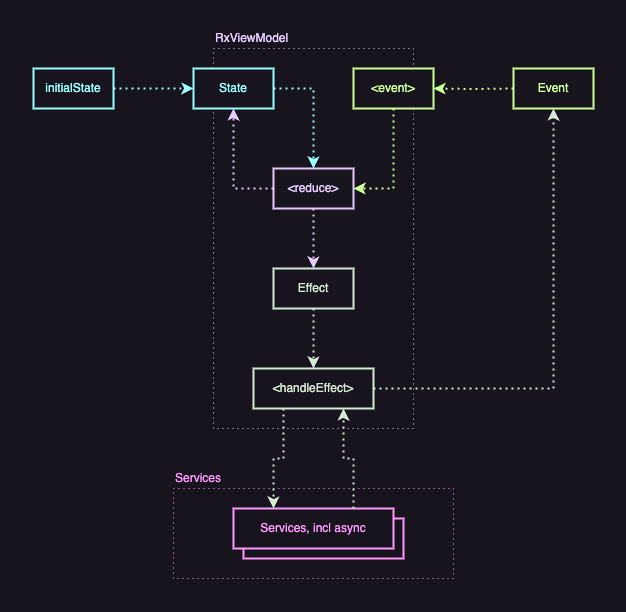

# IMRX: "I'm Rx"

Welcome to `IMRX`, a Swift package designed by Igor Malyarov. The name `IMRX` is a nod to reactive programming principles, while also incorporating my initials "IM".

## Description

`IMRX` is a Swift package developed to enhance the Swift development experience. It provides a set of tools, extensions, and utilities designed to streamline and optimize your coding process in Swift.



## Features

- **User-Friendly API**: `IMRX` offers an intuitive and easy-to-use API, making it accessible for developers at all levels.
- **Example Projects**: Included are example projects demonstrating the practical applications and benefits of using `IMRX`.

## Installation

### Swift Package Manager

You can use [The Swift Package Manager](https://swift.org/package-manager/) to install `IMRX` by adding the proper description to your `Package.swift` file:

```swift
import PackageDescription

let package = Package(
    name: "YourProject",
    dependencies: [
        .package(url: "https://github.com/igor1309/IMRX.git", from: "1.0.0")
    ]
)
```

Then, simply import `IMRX` in your Swift files where you'd like to use it:

```swift
import IMRX
```

## Usage

Here's a basic example to get you started with `IMRX`:

```swift
import IMRX

struct SampleState {
  // fields
}

enum SampleEvent {
  // cases
}

enum SampleEffect {
  // cases
}

final class SampleReducer {
  func reduce(_ state: inout SampleState, _ event: SampleEvent) -> SampleEffect? {
    // ...
  }
}

final class SampleEffectHandler {
  func handleEffect(_ effect: SampleEffect, _ dispatch: @escaping (SampleEvent) -> Void) {
    // ...
  }
}

typealias SampleViewModel = RxViewModel<SampleState, SampleEvent, SampleEffect>

func makeSampleViewModel() -> SampleViewModel {
  let initialState = SampleState()
  let reducer = SampleReducer()
  let effectHandler = SampleEffectHandler()

  return .init(initialState: initialState, reducer: reducer, effectHandler: effectHandler)
}
```

Feel free to explore and experiment with the functionalities that `IMRX` offers in your Swift applications.

## Decorators

In `IMRX`, decorators can be a powerful way to enhance and modify the behavior of your functions or classes without changing their core implementation. If you're interested in learning more about how decorators work and how you can leverage them in your Swift projects, check out this [blog post on decorators](https://yourblog.com/decorators-in-swift).

## Contributing

Contributions to `IMRX` are warmly welcomed! If you'd like to contribute, please feel free to fork the repository, make your changes, and create a pull request.

## License

`IMRX` is released under the [MIT License](LICENSE). See the LICENSE file in the repository for more details.

---

Happy Coding!

Igor Malyarov
